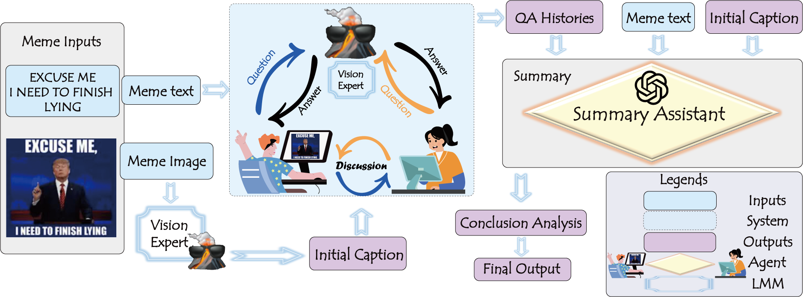

# 🚀 MemeAgent Code Repository

---

### 📚 Overview

This repository hosts the codebase for our research paper titled, "Ask, Acquire, Understand: A Multimodal Agent-based Framework for Social Abuse Detection in Memes."



The meme text and initial caption are used to initiate the multi-agent chat. Through agent discussion (**Ask**), informative information is acquired from the vision expert (**Acquire**). The QA histories and basic meme information assist the summary assistant in understanding the meme (**Understand**) before generating the final result.

---

### 📝 Our Main Contributions

Our main contributions are as follows:

- **Innovative Framework**: We introduce a novel multimodal multi-agent framework to generate informative meme descriptions by asking insightful questions and enhancing visual descriptions in zero-shot settings. To the best of our knowledge, we are the first to apply a multi-agent approach to detecting social abuse in memes.
- **LLM & LMM Collaborative Insights**: We leverage an LLM as two agents and an LMM as a vision expert to ask targeted questions and obtain high-quality answers. Specifically, the agents continuously discuss through instructional prompts, gathering informative captions from the LMM. Finally, the LLM leverages the generated discussion history from the previous step to classify and produce the final predictions.
- **Robust Performance**: Experimental results on the memes benchmark dataset, GOAT-Bench, comprising 6,626 memes across five tasks related to social abuse, show that our framework outperforms SOTA methods, is robust and is generalizable to identify social abuse in memes.

---

### 📝 Note

To reproduce the results presented in our paper, we will provide the log files generated by the `multiAgentChat` component in the official repository upon acceptance of the paper.

---

### 🗂️ Directory Structure

The codebase is structured as follows:

```bash
MemeAgent
├── config.json
├── example.ipynb
├── goat_dataset
│   ├── harmfulness
│   │   ├── images
│   │   └── test.jsonl
│   ├── hatefulness
│   │   ├── images
│   │   └── test.jsonl
│   ├── misogyny
│   │   ├── images
│   │   └── test.jsonl
│   ├── offensiveness
│   │   ├── images
│   │   └── test.jsonl
│   └── sarcasm
│       ├── images
│       └── test.jsonl
├── history
├── load_dataset.py
├── logs
├── multiAgentChat.py
├── oai_keys.py
├── prompt
│   ├── harmful.py
│   ├── hateful.py
│   ├── misogynistic.py
│   ├── offensive.py
│   └── sarcastic.py
├── prompt_dict.py
├── results
├── summary.py
└── tool
    ├── cogvlm_tool.py
    ├── llava13b_tool.py
    └── qwen_tool.py
```

---

### 📁 Directories Description

- **goat_dataset** 📂: Contains the GOAT-bench dataset. The dataset is categorized by the type of social abuse (harmfulness, hatefulness, misogyny, offensiveness, sarcasm). Original images can be accessed from the [GOAT-bench](https://huggingface.co/datasets/HKBU-NLP/GOAT-Bench) Hugging Face repository.
- **logs** 📝: Stores the log files for each execution session.
- **results** 📊: Holds the outcomes of each run, including JSON files containing ground truth labels, predictions, and additional metadata.
- **history** 🗄️: Archives the dialogue histories in YAML format, useful for further analysis and experimentation with different definitions.
- **prompt** 📋: Houses the prompts used for each task within the framework.
- **tool** ⚙️: Contains the Large Model (LM) tools that are utilized in `multiAgentChat.py` for image data extraction.

---

### 🔑 Key Files

- **config.json** 🛠️: Configuration file for the `multiAgentChat.py` script. Ensure paths are correctly set before running.
- **oai_keys.py** 🔐: Contains OpenAI API keys and base URL necessary for API interactions.
- **load_dataset.py** 📥: Script for loading the dataset, returning image paths and labels.
- **prompt_dict.py** 📖: Defines the prompt dictionary for each task, crucial for `summary.py`.
- **multiAgentChat.py** 💬: Central file where dialogue generation, image information retrieval, and final prediction logic are implemented.
- **summary.py** 📈: Used for summarizing dialogue histories and generating predictions post `multiAgentChat.py` execution.
- **example.ipynb** 📓: A Jupyter notebook demonstrating how to execute the codebase.


